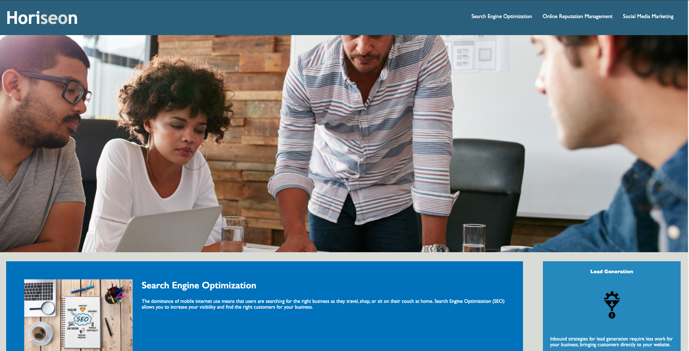
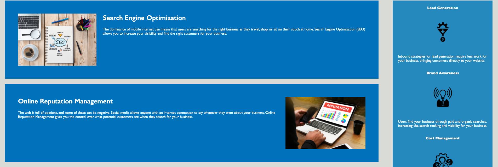

# Refactor of Horiseon's Website

In this project, I refactored the code for Horiseon's website (a company that specializes in SEO, online reputation management and social media marketing) to improve the website's accessibility, improve the the general readibility of the code, and to comform the website to the client provided mockup.    

## Specific Changes

The specific refactoring of the code included, without limitation, adding title information, adding accessibility information to the images, subsituting in semantic HTML elements where applicable, consolidating and organizing the CSS to shorten and simply the code, adding informative comments, repairing inoperable links, and re-sizing the main image, various fonts and certain margins to conform the live website to the client provided mockup.  

## Deployment

Horiseon's refactored website has been deloyed and can be accessed here: https://greenmanaustin.github.io/Horiseon-Refactor/

Here are a couple of screenshots of the live website:

## Skills Learned

The process of refactoring is best accomplished by first taking the requisite time to learn the functionality of the existing code.  After that, and before making any changes to the code, outlining on paper all the changes that need to be made.  Finally, when making code changes, each change needs to be tested before proceeding to the next change.  There is a high risk of breaking the code with any given change so each change needs to be completed, including repairing any breaks in functionality, before proceeding to the next change.  Otherwise it may be difficult to ascertain what code change caused the break in functionality.  

